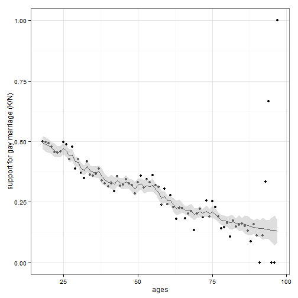

## Why Stan?

> Optimization is bad, expectations are really important, Hamiltonian Monte Carlo is the right thing to do, and Stan is the right way to do the Hamiltonian Monte Carlo. 
> <p style="text-align:right">-- Michael Betancourt, Reykjavik, 2014</p>

## Workflow

1. Write the source code in the modeling language to specify the model ($P(\mathcal{D}\mid\theta)$);
2. Use the compiler or some wrapper to compile and do the inference ($P(\theta\mid\mathcal{D})$).
 + Shell, R, Python, MATLAB, Julia

   We use RStan here.

--- &tabs

## Example 1: linear regression

$$
y_n=\alpha+\beta x_n+\epsilon_n\quad\mbox{where}\quad\epsilon_n\sim\mathcal{N}(0,\sigma^2)
$$

*** class:active id:figure


*** id:stan-code


```r
data {
  int<lower=0> N;
  vector[N] x;
  vector[N] y;
}
parameters {
  real alpha;
  real beta;
  real<lower=0> sigma_sqrt;
}
model {
  y ~ normal(alpha + beta * x, sigma_sqrt); // no prior = improper prior
}
```

--- &twocol_with_width

## First things to learn

$$
y_n=\alpha+\beta x_n+\epsilon_n\quad\mbox{where}\quad\epsilon_n\sim\mathcal{N}(0,\sigma^2)
$$

*** =left width:50%


```r
data {
  int<lower=0> N;
  // multidimensional: matrix[N,K] x;
  vector[N] x; 
  vector[N] y;
}
parameters {
  real alpha;
  // multidimensional: vector[K] beta;
  real beta; 
  real<lower=0> sigma_sqrt;
}
model {
  y ~ normal(alpha + beta * x, sigma_sqrt); 
}
```

*** =right width:50%

Blocks:
 1. required: `data`, `parameters`, `model`
 2. optional:
   + `transformed data`, <br>`transformed parameters`: <br>"...allow new variables to be declared and then defined through a
sequence of statements."
   + `generated quantities`: <br>for direct generation (e.g., you need to predict some `y_new` given `x_new`)


--- &twocol_with_width

## First things to learn

$$
y_n=\alpha+\beta x_n+\epsilon_n\quad\mbox{where}\quad\epsilon_n\sim\mathcal{N}(0,\sigma^2)
$$

*** =left width:50%


```r
data {
  int<lower=0> N;
  // multidimensional: matrix[N,K] x;
  vector[N] x; 
  vector[N] y;
}
parameters {
  real alpha;
  // multidimensional: vector[K] beta;
  real beta; 
  real<lower=0> sigma_sqrt;
}
model {
  y ~ normal(alpha + beta * x, sigma_sqrt); 
}
```

*** =right width:50%

Data types:
 1. primitive: `int`, `real`
 2. vector/matrix: `vector`, `row_vector`, `matrix`
 3. array: "any type can be made into an array type by declaring array arguments." <br>Examples: <br>`real x[10]; matrix[3,3] m[6,7];`
 4. constraints
  + `upper` and `lower`
  + `unit_vector`, `cov_matrix`, ...


--- &tabs

## Compile and do inference

*** class:active id:R-code


```r
library(rstan)
N <- 100; x <- 1:N; alpha <- 50; beta <- 0.2
y <- alpha + beta * x + rnorm(n, mean=0, sd=4)
lr_stan_data <- list(N=N, x=x, y=y)
# stan source code stored in lr_stan_code
lr_fit <- stan(model_code=lr_stan_code, data=lr_stan_data, iter=1000, chains=4)
```

*** id:stan-result


```r
> lr_fit
Inference for Stan model: lr_code.
4 chains, each with iter=1000; warmup=500; thin=1; 
post-warmup draws per chain=500, total post-warmup draws=2000.

              mean se_mean   sd    2.5%     25%     50%     75%   97.5% n_eff Rhat
alpha        52.16    0.03 0.79   50.56   51.62   52.18   52.72   53.65   679 1.00
beta          0.17    0.00 0.01    0.14    0.16    0.17    0.17    0.19   688 1.00
sigma_sqrt    3.97    0.01 0.29    3.45    3.77    3.96    4.15    4.59   609 1.00
lp__       -185.67    0.06 1.25 -188.86 -186.29 -185.35 -184.77 -184.26   497 1.01

Samples were drawn using NUTS(diag_e) at Sun Mar 22 22:21:52 2015.
For each parameter, n_eff is a crude measure of effective sample size,
and Rhat is the potential scale reduction factor on split chains (at 
convergence, Rhat=1).
```

--- &tabs

## Example 2: Gaussian process

### Younger Americans are more likely to support the statewide legalization of gay marriage

*** class:active id:data


*** id:gp-result


